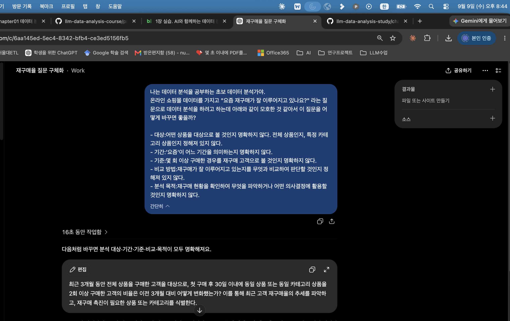
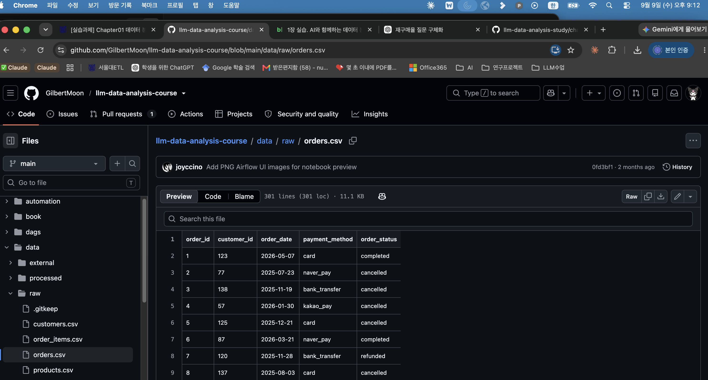
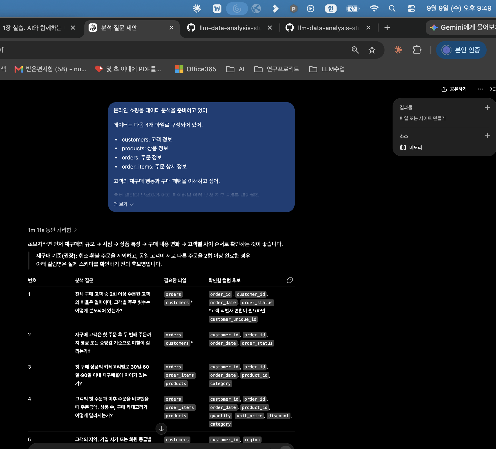
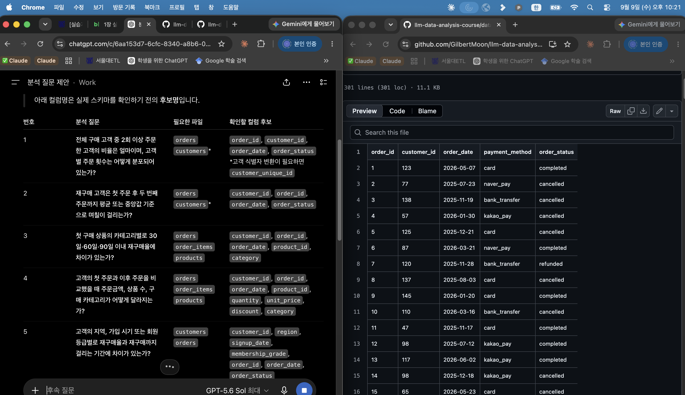
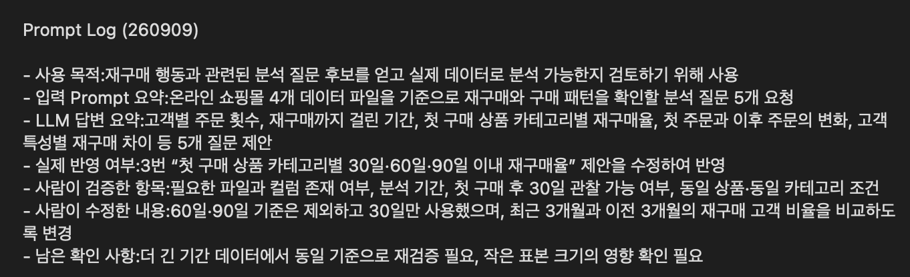
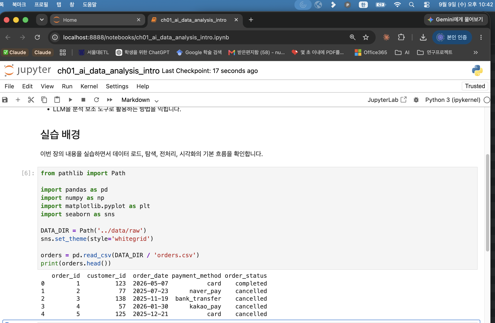

# Chapter 01 제출 답안. AI와 함께하는 데이터 분석의 시작

> 이 파일은 Chapter 01 실습 결과를 정리하여 제출하기 위한 학생용 템플릿입니다.  
> 강사 저장소의 원본 템플릿을 직접 수정하지 말고, 자신의 PC에 복사한 뒤 작성합니다.

---

## 0. 제출 정보

- 이름: 송누리
- GitHub ID: HauserNR 
- 개인 저장소명: `llm-data-analysis-study`
- 작성일: 2026.09.09
- 사용한 LLM: ChatGPT

### 최종 제출 URL

```text
https://github.com/HauserNR/llm-data-analysis-study/blob/main/chapter01/chapter01.md
```

---

## 1. 원래 업무 질문

### 내가 선택한 막연한 질문

```text
요즘 재구매가 잘 이루어지고 있나요?
```

### 왜 이 질문이 모호하다고 생각했는가?

- 대상:어떤 상품을 대상으로 볼 것인지 명확하지 않다. 전체 상품인지, 특정 카테고리 상품인지 정해져 있지 않다.
- 기간:'요즘'이 어느 기간을 의미하는지 명확하지 않다.
- 기준:몇 회 이상 구매한 경우를 재구매 고객으로 볼 것인지 명확하지 않다.
- 비교 방법:재구매가 잘 이루어지고 있는지를 무엇과 비교하여 판단할 것인지 정해져 있지 않다.
- 분석 목적:재구매 현황을 확인하여 무엇을 파악하거나 어떤 의사결정에 활용할 것인지 명확하지 않다.

### 분석 가능한 질문으로 다시 작성

```text
최근 3개월 동안 전체 상품을 구매한 고객을 대상으로, 첫 구매 후 30일 이내에 동일 상품 또는 동일 카테고리 상품을 2회 이상 구매한 고객의 비율은 이전 3개월 대비 어떻게 변화했는가?
```

### 결과 관찰

질문을 생각한 후에 각 항목에서 이 질문이 모호한지 직접 생각해서 작성한 후 LLM한테 이 질문이 이런 기준에서 모호한 점을 가지고 있는데 어떻게 바꾸면 좋을지 질문했다.

### 나의 해석과 판단

‘재구매가 잘 이루어진다’는 표현만으로는 분석 기준이 너무 넓고 사람마다 다르게 해석할 수 있다고 생각했다.
따라서 분석 대상과 기간을 정하고, 재구매를 판단할 상품 범위와 구매 횟수, 첫 구매 이후 관찰 기간을 명확하게 정의하는 것이 필요하다고 판단했다.
또한 단순히 현재 재구매율만 계산하는 것보다 이전 3개월과 비교하면 최근 재구매 행동이 개선되었는지 또는 감소했는지를 더 명확하게 확인할 수 있다고 생각했다.

### 업무·분석적 의미

최근 3개월의 재구매 고객 비율을 이전 3개월과 비교하면 고객의 반복 구매 행동이 최근 어떻게 변하고 있는지 확인할 수 있다.
특히 동일 상품뿐 아니라 동일 카테고리 상품까지 포함하여 보면 개별 상품의 반복 구매뿐 아니라 같은 상품군 안에서의 추가 구매 행동도 함께 파악할 수 있다.
이 결과는 고객 유지 수준과 반복 구매 유도 전략을 검토하는 기초 자료로 활용할 수 있다.

### 한계와 추가 확인 사항

현재 단계에서는 실제 CSV 파일의 컬럼을 직접 확인하지 않았기 때문에
고객을 식별할 수 있는 컬럼, 주문 일자, 주문 상태, 상품 ID, 상품 카테고리 등의 정보가 실제로 존재하는지 확인이 필요하다.
또한 “첫 구매 후 30일 이내”를 계산하려면 고객별 최초 구매일과 이후 구매일을 정확히 비교할 수 있어야 한다.
최근 3개월 말미에 첫 구매한 고객은 30일의 관찰 기간이 충분히 확보되지 않을 수 있으므로,
실제 분석 시 기준일과 데이터의 마지막 날짜를 확인하여 비교 조건을 보완할 필요가 있다.

### Evidence



---

## 2. 질문과 필요한 데이터 연결

### 필요한 데이터 파일

- [x] `customers.csv`
- [x] `products.csv`
- [x] `orders.csv`
- [x] `order_items.csv`

### 필요한 컬럼 후보

| 파일 | 필요한 컬럼 | 필요한 이유 |
| --- | --- | --- |
| `customers.csv` | `customer_id` | 고객을 식별하고 주문 데이터와 연결하기 위해 필요 |
| `orders.csv` | `order_id`, `customer_id`, `order_date`, `order_status` | 고객별 최초 구매일, 이후 주문일, completed 주문 여부를 확인하기 위해 필요 |
| `order_items.csv` | `order_id`, `product_id` | 각 주문에 포함된 상품을 확인하고 동일 상품의 반복 구매 여부를 판단하기 위해 필요 |
| `products.csv` | `product_id`, `category` | 상품과 카테고리를 연결하여 동일 카테고리 상품의 반복 구매 여부를 판단하기 위해 필요 |

### 데이터 연결 관계

```text
customers.customer_id
        ↓
orders.customer_id

orders.order_id
        ↓
order_items.order_id

products.product_id
        ↓
order_items.product_id
```

### 결과 관찰

실제 CSV 파일을 확인한 결과, customers.csv에는 150명의 고객 정보가 있으며 customer_id가 존재한다.
orders.csv에는 300건의 주문과 order_id, customer_id, order_date, order_status 컬럼이 존재한다.
order_items.csv에는 764개의 주문 상세 행이 있으며 order_id, product_id를 통해 주문과 상품을 연결할 수 있다.
products.csv에는 100개의 상품과 product_id, category 컬럼이 존재한다.

네 파일의 주요 ID 컬럼은 중복 없이 식별자로 사용할 수 있었고,
orders.customer_id → customers.customer_id, order_items.order_id → orders.order_id,
order_items.product_id → products.product_id 연결에서도 참조되지 않는 값은 확인되지 않았다.
또한 네 파일의 컬럼에서 결측값도 확인되지 않았다.

orders.csv의 전체 주문 기간은 2025-07-09부터 2026-07-08까지이며,
주문 상태는 completed, cancelled, refunded 세 종류이다.
이 중 실제 구매 행동을 분석하기 위해 completed 주문만 사용하면 184건이며,
completed 주문의 기간은 2025-07-09부터 2026-07-05까지이다.

### 나의 해석과 판단

질문에 필요한 고객 식별 정보, 주문 날짜, 주문 상태, 상품 ID와 상품 카테고리 정보가 모두 실제 데이터에 존재하므로
현재 데이터만으로 재구매 분석을 수행할 수 있다고 판단했다.

다만 취소되거나 환불된 주문을 재구매로 포함하면 실제 구매 행동을 과대평가할 수 있으므로
재구매 판단에는 order_status = completed인 주문만 사용하는 것이 적절하다고 판단했다.
또한 재구매 횟수는 한 주문에서 여러 개를 구매한 수량이 아니라 서로 다른 주문 시점을 기준으로 계산하는 것이 적절하다고 생각했다.

### 업무·분석적 의미

질문을 실제 데이터 구조와 연결해보면서 재구매율을 계산하려면 단순히 고객과 주문 데이터만 보는 것이 아니라
주문 상세와 상품 카테고리 데이터까지 함께 연결해야 한다는 점을 확인할 수 있었다.
이 과정을 먼저 수행하면 필요한 데이터가 실제로 존재하는지 검증한 뒤 분석을 시작할 수 있어
잘못된 컬럼이나 가정을 바탕으로 분석하는 문제를 줄일 수 있다.

### 한계와 추가 확인 사항

1.“첫 구매”는 고객의 최초 completed 주문으로 정의할 필요가 있다.
2.“2회 이상 구매”가 첫 구매를 포함한 총 2회인지, 첫 구매 이후 추가로 2회 이상인지 명확한 계산 정의가 필요하다.
3.최근 3개월과 이전 3개월을 비교할 때 각 고객에게 첫 구매 후 30일의 관찰 기간이 동일하게 확보되어야 한다.
4.데이터의 마지막 completed 주문일이 2026-07-05이므로, 30일의 후속 구매 기간을 완전히 관찰하려면 최근 비교 구간의 종료일을 2026-06-05 이전으로 설정해야 한다.

### Evidence

필요한 경우 관계도 또는 데이터 파일 확인 화면을 첨부하세요.



---

## 3. LLM에게 분석 질문 후보 요청

### 사용 목적

```text
실제 온라인 쇼핑몰 데이터의 파일과 컬럼 구조를 바탕으로
재구매 및 반복 구매 행동을 확인할 수 있는 분석 질문 후보를 얻고,
각 질문이 현재 데이터로 실제 분석 가능한지 검토하기 위해 LLM을 사용했다.
```

### 사용한 Prompt

```text
온라인 쇼핑몰 데이터 분석을 준비하고 있어.

데이터는 다음 4개 파일로 구성되어 있어.

customers: 고객 정보
products: 상품 정보
orders: 주문 정보
order_items: 주문 상세 정보

고객의 재구매 행동과 구매 패턴을 이해하고 싶어.

초보 데이터 분석자가 먼저 확인해볼 만한 분석 질문 5개를 제안해줘.
각 질문마다 필요한 데이터 파일과 확인해야 할 컬럼 후보도 같이 적어줘.

원인을 미리 단정하지 말고, 현재 데이터로 실제 확인할 수 있는 질문 중심으로 제안해줘.
```

### LLM 답변 요약

LLM의 전체 답변을 그대로 복사하지 말고 핵심 제안 3~5개를 요약하세요.

1.전체 구매 고객 중 2회 이상 주문한 고객의 비율은 얼마이며, 고객별 주문 횟수는 어떻게 분포되어 있는가?
2.재구매 고객은 첫 주문 후 두 번째 주문까지 평균 또는 중앙값 기준으로 며칠이 걸리는가?
3.첫 구매 상품의 카테고리별로 30일·60일·90일 이내 재구매율에 차이가 있는가?
4.고객의 첫 주문과 이후 주문을 비교했을 때 주문금액, 상품 수, 구매 카테고리가 어떻게 달라지는가?
5.고객의 지역, 가입 시기 또는 회원 등급별로 재구매율과 재구매까지 걸리는 기간에 차이가 있는가?

### 결과 관찰

LLM은 재구매를 단순히 “2회 이상 주문한 고객의 비율”로만 보지 않고,
첫 구매 후 두 번째 구매까지 걸리는 기간, 첫 구매 상품의 카테고리,
첫 주문과 이후 주문의 구매 특성 변화, 고객의 지역·가입 시기·회원 등급 등
여러 관점으로 나누어 총 5개의 분석 질문을 제안했다.

또한 각 질문마다 필요한 파일과 컬럼 후보를 함께 제시했으며,
특히 3번 질문에서는 첫 구매 상품의 카테고리별로 30일·60일·90일 이내 재구매율을 비교하도록 제안했다.

### 나의 해석과 판단

LLM의 제안 중 1번과 2번은 고객별 주문 횟수와 재구매까지 걸리는 기간을 확인하는 비교적 기본적인 분석이고,
3번과 4번은 주문 데이터와 상품 데이터를 연결하여 구매 패턴을 더 구체적으로 확인하는 질문이라고 판단했다.

특히 3번 질문은 내가 STEP 1에서 정한 분석 질문과 가장 가까워 활용도가 높다고 생각했다.
다만 LLM은 30일·60일·90일을 모두 제안했지만,
내 분석에서는 STEP 1에서 정한 기준에 맞춰 우선 30일 이내 재구매만 확인하는 것이 적절하다고 판단했다.

또한 1번에서 제안한 customer_unique_id와
5번에서 제안한 region, signup_date, membership_grade 등은
실제 데이터에 존재하는지 반드시 확인해야 하므로 LLM의 제안을 그대로 사용할 수는 없다고 판단했다.

### 업무·분석적 의미

LLM을 이용하면 하나의 막연한 주제인 “재구매”를
주문 횟수, 재구매까지 걸린 기간, 상품 카테고리, 구매 금액, 고객 특성 등
여러 분석 관점으로 빠르게 확장할 수 있다는 점을 확인했다.

이러한 질문 후보를 참고하면 실제 업무에서 어떤 지표를 우선 확인할지 정하는 데 도움이 되며,
그중 현재 보유한 데이터와 분석 목적에 맞는 질문을 선택하여 구체화할 수 있다.

### 한계와 추가 확인 사항

1.LLM이 제안한 컬럼이 실제 데이터에 존재하는지 확인해야 한다.
2.customer_unique_id가 실제로 필요한지 확인해야 한다.
3.region, signup_date, membership_grade 등 고객 특성 컬럼의 존재 여부를 확인해야 한다.
4.30일·60일·90일 재구매율을 모두 계산할 수 있을 만큼 충분한 데이터 기간이 있는지 확인해야 한다.
5.첫 구매 상품의 카테고리를 기준으로 재구매를 볼 경우, 동일 상품 재구매와 동일 카테고리 재구매를 어떻게 정의할지 추가로 정해야 한다.

### Evidence



---

## 4. LLM 제안 검증

LLM 제안 중 하나 이상을 선택해 검토합니다.

| 검증 항목 | 확인 내용 |
| --- | --- |
| 선택한 LLM 제안 | 3번: 첫 구매 상품의 카테고리별로 30일·60일·90일 이내 재구매율에 차이가 있는가? |
| 필요한 파일 | `orders.csv`, `order_items.csv`, `products.csv` |
| 필요한 컬럼 | `customer_id`, `order_id`, `order_date`, `product_id`, `category` |
| 계산 범위 | 최근 3개월과 이전 3개월을 비교하고, 첫 구매 후 30일 이내 재구매만 사용 |
| 실제 데이터 확인 필요 여부 | 필요 |
| 원인 단정 여부 | 원인을 단정하지 않고 재구매 비율의 차이와 변화만 확인 |
| 최종 판단 | 수정 후 사용 |

### 내가 수정한 내용

```text
LLM은 “첫 구매 상품의 카테고리별로 30일·60일·90일 이내 재구매율에 차이가 있는가?”라고 제안했다.

이 제안을 그대로 사용하지 않고,
내가 STEP 1에서 정한 분석 기준에 맞춰
“최근 3개월 동안 전체 상품을 구매한 고객을 대상으로,
첫 구매 후 30일 이내에 동일 상품 또는 동일 카테고리 상품을 2회 이상 구매한 고객의 비율은
이전 3개월 대비 어떻게 변화했는가?”로 수정했다.

즉, 60일·90일 기준은 제외하고 30일 기준만 사용했으며,
카테고리별 차이보다는 최근 3개월과 이전 3개월의 재구매 고객 비율 변화를 비교하도록 수정했다.
또한 동일 카테고리뿐 아니라 동일 상품의 반복 구매도 재구매 조건에 포함했다.
```

### 결과 관찰

실제 데이터를 확인한 결과 orders.csv에는 customer_id, order_id, order_date, order_status가 존재하고,
order_items.csv에는 order_id, product_id가, products.csv에는 product_id, category가 존재해서
LLM의 3번 제안을 기반으로 한 분석이 가능했다.

하지만 최근 3개월 말미에 첫 구매한 고객은 첫 구매 후 30일을 충분히 관찰할 수 없으므로,
비교 기간을 데이터의 마지막 completed 주문일보다 30일 앞에서 종료하도록 조정했다.

이 기준으로 확인한 결과, 이전 3개월에는 25명 중 1명이 조건을 충족하여 4.0%였고, 최근 3개월에는 8명 중 조건을 충족한 고객이 없어 0.0%였다. 따라서 최근 3개월의 재구매 고객 비율은 이전 3개월보다 4.0%p 낮게 나타났다.

### 나의 해석과 판단

LLM의 3번 제안은 실제 데이터에 필요한 컬럼이 모두 존재하여 활용할 수 있었지만, 내가 정한 분석 목적과 정확히 일치하지는 않아 수정 후 사용하는 것이 적절하다고 판단했다.

또한 실제 계산에서는 최근 3개월의 대상 고객이 8명으로 적기 때문에 4.0%p 감소했다는 결과만으로 재구매가 실제로 악화되었다고 단정하기는 어렵다.
따라서 이번 결과는 재구매율 변화의 현황을 확인한 것으로 해석하고, 추가 데이터가 확보된 뒤 다시 비교할 필요가 있다고 판단했다.

### 업무·분석적 의미

LLM의 질문 제안은 분석 방향을 잡는 데 도움이 되었지만,
실제 업무에 사용하려면 분석 목적, 데이터 기간, 계산 기준을 사람이 직접 조정해야 한다는 점을 확인했다.

특히 재구매율과 같이 일정한 관찰 기간이 필요한 지표는
최근 고객에게도 동일한 30일 관찰 기간이 주어지는지 확인하지 않으면
기간별 재구매율을 잘못 비교할 수 있다.

### 한계와 추가 확인 사항

-최근 3개월 대상 고객이 8명으로 적어 결과의 변동성이 클 수 있다.
-이번 분석에서는 첫 구매 후 30일만 확인했으며, 60일·90일 기준은 분석하지 않았다.
-동일 상품 또는 동일 카테고리의 “2회 이상 구매” 정의에 따라 결과가 달라질 수 있다.
-더 긴 기간의 데이터가 확보되면 동일한 기준으로 다시 비교할 필요가 있다.

### Evidence



---

## 5. Prompt Log

- 사용 목적:재구매 행동과 관련된 분석 질문 후보를 얻고 실제 데이터로 분석 가능한지 검토하기 위해 사용
- 입력 Prompt 요약:온라인 쇼핑몰 4개 데이터 파일을 기준으로 재구매와 구매 패턴을 확인할 분석 질문 5개 요청
- LLM 답변 요약:고객별 주문 횟수, 재구매까지 걸린 기간, 첫 구매 상품 카테고리별 재구매율, 첫 주문과 이후 주문의 변화, 고객 특성별 재구매 차이 등 5개 질문 제안
- 실제 반영 여부:3번 “첫 구매 상품 카테고리별 30일·60일·90일 이내 재구매율” 제안을 수정하여 반영
- 사람이 검증한 항목:필요한 파일과 컬럼 존재 여부, 분석 기간, 첫 구매 후 30일 관찰 가능 여부, 동일 상품·동일 카테고리 조건
- 사람이 수정한 내용:60일·90일 기준은 제외하고 30일만 사용했으며, 최근 3개월과 이전 3개월의 재구매 고객 비율을 비교하도록 변경
- 남은 확인 사항:더 긴 기간 데이터에서 동일 기준으로 재검증 필요, 작은 표본 크기의 영향 확인 필요

### 결과 관찰

Prompt Log를 통해 LLM이 제안한 5개의 질문 중 3번 질문을 선택하고, 실제 데이터와 STEP 1의 분석 목적에 맞게 수정하여 사용한 과정을 확인할 수 있었다.

### 나의 해석과 판단

LLM의 제안을 그대로 사용하는 것보다, 제안된 질문이 실제 데이터의 컬럼과 기간으로 계산 가능한지 확인하고 분석 목적에 맞게 범위와 기준을 수정하는 과정이 매우 중요하다는 생각이 들었다.
특히 이번에는 LLM이 제안한 30일·60일·90일 중 30일만 사용하고, 카테고리별 비교 대신 최근 3개월과 이전 3개월을 비교하도록 변경했다는 점을 Prompt Log에 기록할 필요가 있다고 생각했다.

### Evidence



---

## 6. 개인정보와 Secret 보호 확인

다음 항목을 확인합니다.

- [x] 실제 이름·이메일·전화번호 등 고객 개인정보를 Prompt에 사용하지 않았습니다.
- [x] API Key를 코드나 Notebook에 직접 작성하지 않았습니다.
- [x] `.env` 실제 내용을 캡처하거나 업로드하지 않았습니다.
- [x] GitHub Token, 비밀번호, 내부 URL이 캡처에 보이지 않습니다.
- [x] 제출 전 이미지까지 다시 확인했습니다.

### 나의 판단

실제 customers.csv에는 고객 이름과 같은 개인정보가 포함되어 있으므로 LLM Prompt나 Public GitHub의 Evidence 화면에는 실제 고객 이름을 노출하지 않는 것이 적절하다고 판단했다.
이번 분석에는 고객을 식별하기 위한 customer_id만 필요하며 실제 이름은 사용할 필요가 없다.
또한 API Key, Token, Password, .env 실제 내용과 같은 민감 정보도 Prompt와 캡처에서 제외해야 한다고 생각했다.

---

## 7. Chapter 01 Notebook 확인

Notebook:

```text
notebooks/ch01_ai_data_analysis_intro.ipynb
```

### 내 환경 상태

- [ ] 아직 환경설정 전이라 Notebook 위치만 확인했습니다.
- [x] 환경설정이 완료되어 Notebook을 직접 실행했습니다.

### 환경설정 완료 학생만 작성

#### 실행한 코드

```python
from pathlib import Path

import pandas as pd
import numpy as np
import matplotlib.pyplot as plt
import seaborn as sns

DATA_DIR = Path('../data/raw')
sns.set_theme(style='whitegrid')
```

#### 실행 결과

```text
오류 없이 실행되었는지 작성하세요.
```

#### 결과 관찰

실행 결과에서 확인한 사실을 작성하세요.

#### 나의 해석과 판단

현재 Notebook이 본격 분석이 아니라 starter scaffold라는 의미를 자신의 말로 설명하세요.

#### 한계와 추가 확인 사항

Chapter 02 또는 Chapter 03에서 추가로 확인해야 할 내용을 작성하세요.

#### Evidence



> 환경설정 전이라면 이 이미지는 생략할 수 있습니다.

---

## 8. Chapter 01 최종 해석

### 이번 장에서 가장 중요하다고 생각한 내용

```text
데이터 분석에서는 막연한 업무 질문을 바로 계산하기보다 먼저 대상, 기간, 기준과 비교 방법을 명확히 정하는 것이 중요하다고 생각했다.
실제 데이터를 확인해 보니 필요한 컬럼이 존재하더라도 “재구매”처럼 정의에 따라 결과가 달라지는 지표는 사람이 계산 기준을 정해야 했다.
또한 최근 기간을 비교할 때는 데이터의 마지막 날짜와 30일 관찰 기간까지 고려해야 공정한 비교가 가능했다.
LLM은 분석 질문과 방법을 제안하는 데 도움이 되지만, 실제 데이터 검증과 최종 기준 설정은 사람이 책임져야 한다고 생각했다.
```

### LLM을 데이터 분석에 사용할 때 가장 조심해야 할 점

```text
LLM이 자연스럽고 그럴듯한 분석 질문이나 계산 방법을 제안하더라도 실제 데이터에 필요한 컬럼이 존재하는지, 지표의 정의가 명확한지, 비교 기간이 공정한지 확인하지 않고 그대로 사용하면 안 된다고 생각한다.
특히 같은 “재구매율”이라도 첫 구매 포함 여부와 반복 구매 횟수 기준에 따라 결과가 달라질 수 있으므로 사람이 기준을 명확하게 정하고 검증해야 한다.
```

### 사람과 LLM의 역할 차이

| 항목 | LLM이 도울 수 있는 부분 | 사람이 책임져야 하는 부분 |
| --- | --- | --- |
| 질문 정의 | 막연한 질문을 구체화하고 분석 질문 후보를 제안 | 실제 업무 목적에 맞는 대상·기간·기준·비교 방법 결정 |
| 데이터 확인 | 필요한 파일과 컬럼 후보 제안 | 실제 컬럼, 결측, 키 관계, 데이터 기간 확인 |
| 코드 작성 | 계산 코드나 분석 방법의 초안 제안 | 코드 실행 결과와 계산 정의 검증 |
| 결과 해석 | 가능한 해석 방향과 추가 분석 아이디어 제안 | 데이터로 확인된 사실과 추정을 구분하여 해석 |
| 최종 판단 | 여러 선택지와 검토 항목 제안 | 분석 결과의 사용·수정·보류 결정 |

### 다음 Chapter에서 확인하고 싶은 것

```text
실제 CSV를 pandas로 불러와 고객별 최초 completed 주문일을 계산하고, 첫 구매 후 30일 이내의 동일 상품 또는 동일 카테고리 반복 주문을 코드로 직접 계산해 보고 싶다.
또한 재구매 기준을 다르게 설정했을 때 결과가 얼마나 달라지는지도 비교도 해보고 싶다.
```

---

## 9. 최종 제출 체크리스트

- [x] 원래 업무 질문과 구체화한 분석 질문을 작성했습니다.
- [x] 질문에 필요한 데이터 파일과 컬럼 후보를 정리했습니다.
- [x] LLM Prompt와 답변 요약을 작성했습니다.
- [x] LLM 제안을 실제 데이터 관점에서 검증했습니다.
- [x] 각 핵심 STEP의 결과 관찰을 작성했습니다.
- [x] 각 핵심 STEP의 나의 해석과 판단을 작성했습니다.
- [x] 업무·분석적 의미를 작성했습니다.
- [x] 한계와 추가 확인 사항을 작성했습니다.
- [x] 핵심 실행 Evidence 이미지를 첨부했습니다.
- [x] 이미지가 Markdown에서 정상 표시됩니다.
- [x] 개인정보가 없습니다.
- [x] API Key·Secret·Token이 없습니다.
- [x] 개인 GitHub 저장소에 업로드했습니다.
- [x] GitHub에서 Markdown과 이미지가 정상 표시됩니다.
- [x] 아래 최종 파일 URL이 정상적으로 열립니다.

### 최종 파일 URL

```text
https://github.com/HauserNR/llm-data-analysis-study/blob/main/chapter01/chapter01.md
```

---

## 10. 교수자 확인용 요약

### 수행 상태

- [x] COMPLETE
- [ ] PARTIAL

### 내가 가장 중요하게 내린 판단 1개

```text
여기에 작성하세요.
```

### 아직 확인이 필요한 내용 1개

```text
여기에 작성하세요.
```
