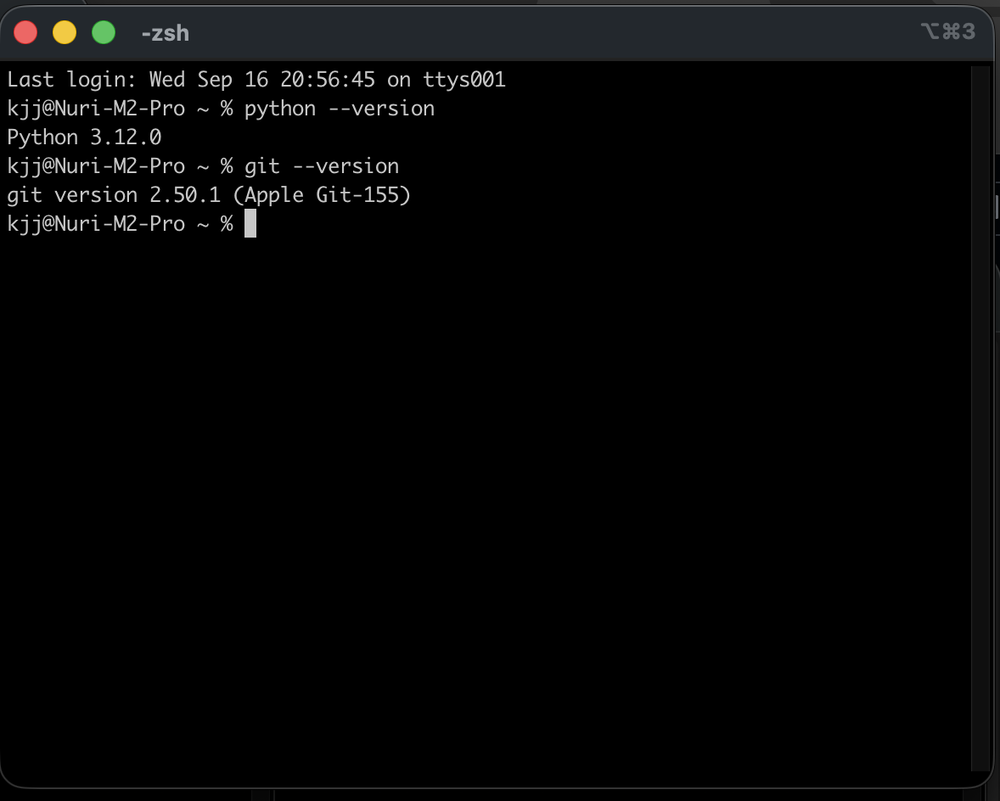
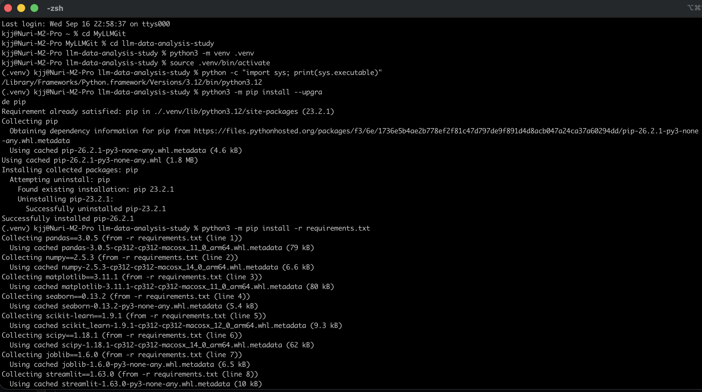
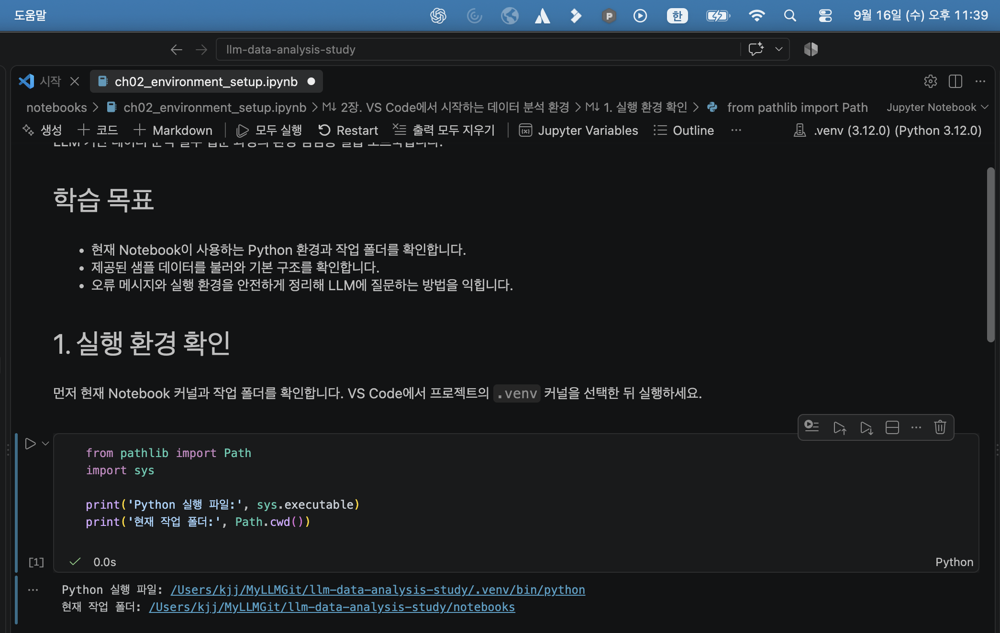
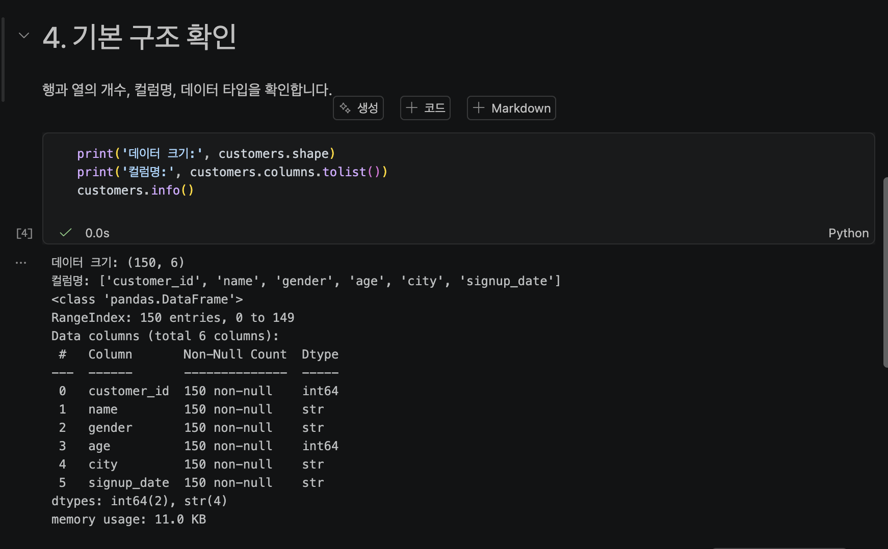
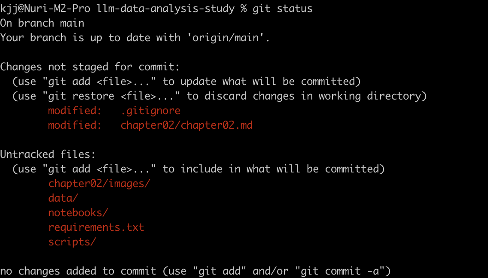

# Chapter 02 제출 답안. VS Code에서 시작하는 데이터 분석 환경

> 최종 파일은 개인 GitHub 저장소의 `chapter02/chapter02.md`로 저장하는 것을 권장합니다.

## 0. 제출 정보

- 이름: 송누리
- GitHub ID: HauserNR
- 개인 저장소: `llm-data-analysis-study`
- 작성일: 2026.09.16
- 운영체제: MacOS

### 최종 제출 URL

```text
https://github.com/HauserNR/llm-data-analysis-study/blob/main/chapter02/chapter02.md
```

---

## 1. Python과 Git 환경 확인

### 실행 내용

```text
python --version 또는 py --version
git --version
```

### 실행 결과

```text
Python 3.12.0
git version 2.50.1 (Apple Git-155)
```

### Evidence



### 결과 관찰

터미널에서 Python 3.12.0과 Git 2.50.1이 표시되어 두 명령을 실행할 수 있음을 확인했다.

### 나의 해석과 판단

기본 도구가 설치되어 있어 실습을 시작할 수 있다. 다만 전역 Python 확인만으로는 충분하지 않으므로 프로젝트 `.venv`의 Python을 사용하는지는 다음 단계에서 확인해야 한다.

### 업무·분석적 의미

버전을 기록하면 패키지 설치·Notebook 실행 오류가 생겼을 때 환경 차이를 비교할 수 있고, Git은 코드와 문서의 변경 이력을 남겨 재현을 돕는다.

### 한계와 추가 확인 사항

VS Code의 Python·Jupyter 확장, `.venv` Python 버전, 패키지 호환성은 아직 확인해야 한다.

---

## 2. 저장소와 `.venv` 준비

### 수행 내용

- [x] 공식 Public 저장소 clone 방법 확인
- [x] 프로젝트 루트 구성 확인
- [x] `.venv` 생성
- [x] `.venv` 활성화
- [x] `requirements.txt` 설치

### 핵심 실행 결과

```text
현재 프로젝트 경로: llm-data-analysis-study
터미널 Python 실행 파일: /Library/Frameworks/Python.framework/Versions/3.12/bin/python3.12
가상환경 활성화 여부: 실행 결과 캡처함
패키지 설치 결과: 실행 결과 캡처함
```

### Evidence



### 결과 관찰

/Users/kjj/MyLLMGit/llm-data-analysis-study/.venv/bin/python3

### 나의 해석과 판단

시스템 Python과 프로젝트 `.venv`를 분리하면 이 실습에 필요한 패키지와 버전을 다른 프로젝트에 영향을 주지 않고 관리할 수 있다.
중간에 python alias 관련 에러가 있어 계속 /Library/Frameworks/Python.framework/Versions/3.12/bin/python3.12 로 결과가 나왔었으나
에러를 해결하고 정상적으로 .venv 경로로 나오게 되었다 

### 업무·분석적 의미

`requirements.txt`와 가상환경을 사용하면 다른 사람이 같은 패키지 구성으로 프로젝트를 재실행할 수 있어 재현성이 높아진다.

### 한계와 추가 확인 사항

기관 PC는 설치 권한·프록시·보안 정책 때문에 제약이 있을 수 있다. PowerShell 실행 정책 오류는 필요할 때 현재 세션 범위에서만 점검하며 시스템 전체 정책을 임의로 바꾸지 않는다.

---

## 3. VS Code 인터프리터와 Jupyter 커널 연결

### 확인 결과

```text
VS Code Python 인터프리터: /Users/kjj/MyLLMGit/llm-data-analysis-study/.venv/bin/python
Notebook sys.executable: /Users/kjj/MyLLMGit/llm-data-analysis-study/.venv/bin/python
Notebook Path.cwd(): /Users/kjj/MyLLMGit/llm-data-analysis-study/notebooks
```

### Evidence



### 결과 관찰

VS Code의 Python 인터프리터와 Notebook 커널을 모두 프로젝트 `.venv`로 선택한 뒤 `sys.executable`과 `Path.cwd()`를 출력해 확인했다.

### 나의 해석과 판단

커널 이름만 비슷해도 실제 실행 파일이 다를 수 있다. 터미널과 Notebook Python이 다르면 한쪽에서 설치한 패키지를 다른 쪽에서 찾지 못할 수 있으므로 `sys.executable` 경로로 판단해야 한다.

### 업무·분석적 의미

동일한 `.venv`를 사용하면 `ModuleNotFoundError`, 패키지 버전 차이, 상대 경로 오류를 줄일 수 있다.

### 한계와 추가 확인 사항

커널 이름만 보고 판단하면 안 된다. VS Code 상태 표시줄의 인터프리터와 Notebook 우측 상단 커널을 선택한 뒤 실제 실행 파일 경로를 다시 확인해야 한다.

---

## 4. 샘플 데이터와 Notebook 실행 검증

### 확인 결과

```text
DATA_DIR 존재 여부: 확인 완료 
customers.csv 존재 여부: 확인완료
customers.shape: (150, 6)
주요 컬럼: ['customer_id', 'name', 'gender', 'age', 'city', 'signup_date']
```

### Evidence



### 결과 관찰

`customers.csv`는 150행 6열이며 위 6개 컬럼을 가진다. 노트북은 `numpy`, `pandas`, `matplotlib`, `seaborn`을 import하고, 현재 폴더가 프로젝트 루트 또는 `notebooks` 폴더인지를 확인해 `data/raw/customers.csv`를 읽도록 구성되어 있다.

### 나의 해석과 판단

`customers.head()`, shape, 컬럼 목록이 정상 출력되면 Notebook·커널·필수 패키지·데이터 경로가 함께 연결되었다고 판단할 수 있다.

### 업무·분석적 의미

분석 전에 작은 CSV를 읽는 스모크 테스트를 하면 대규모 분석 뒤에 경로·권한·패키지 문제를 발견하는 일을 줄일 수 있다.

### 한계와 추가 확인 사항

현재는 환경 연결을 확인한 것이며 결측치, 중복, 값의 타당성 같은 데이터 품질은 아직 검증하지 않았다. 개인 프로젝트에서 실행한 결과 화면도 추가로 필요하다.

---

## 5. 오류 해결 기록

실습 중 오류가 있었다면 작성합니다. 오류가 없었다면 `해당 없음`이라고 적습니다.

### 오류 메시지

```text
해당 없음. 다만 customers.csv가 없을 때는 FileNotFoundError가 발생할 수 있다.
```

### 원인 후보

1. 
2. 
3. 

### 내가 확인한 순서

1. 
2. 
3. 

### 해결 방법

```text
해당 없음
```

### Evidence


### 나의 해석과 판단

해당 없음

### 한계와 추가 확인 사항

해당 없음

---

## 6. Secret 보호 확인

- [x] `.env`는 Git 추적 대상이 아닙니다.
- [x] 실제 API Key를 코드에 작성하지 않았습니다.
- [x] 캡처 화면에 Token/비밀번호가 없습니다.
- [x] `.venv`를 Git에 올리지 않습니다.

### Evidence

필요한 경우 `git status`, `.gitignore` 확인 화면을 첨부합니다.



### 나의 해석과 판단

`.env`에는 실제 개인 Key를, `.env.example`에는 변수 이름과 예시만 저장해야 한다. `.gitignore`로 `.env`와 `.venv`를 제외하고 커밋 전 `git status`, `git ls-files .env`를 확인해야 한다. Secret이 공개되었다면 파일 삭제만 하지 말고 Key를 폐기 또는 재발급해야 한다.

---

## 7. Chapter 02 최종 회고

### 가장 중요했다고 생각한 환경 설정 1가지

```text
프로젝트 .venv를 VS Code 인터프리터와 Jupyter Notebook 커널에 동일하게 연결하는 설정
```

### 그 이유

```text
패키지를 설치한 Python, VS Code 인터프리터, Jupyter 커널이 다르면 설치 후에도 import 오류가 발생할 수 있다. sys.executable로 실제 실행 파일을 확인하면 이를 예방할 수 있다.
```

### 다음 Chapter에서 재사용할 환경 체크 3가지

1. 터미널 Python과 Notebook의 `sys.executable`이 프로젝트 `.venv`를 가리키는지 확인한다.
2. `Path.cwd()`와 데이터 파일 위치를 비교해 상대 경로를 점검한다.
3. CSV의 shape·컬럼·자료형을 출력해 패키지·커널·데이터 연결을 검증한다.

### 현재 환경의 한계 또는 주의점

```text
개인 제출 저장소에는 .venv, 원본 데이터, Notebook 실행 화면이 포함되지 않는다. 다른 PC에서는 공식 프로젝트를 clone하고 의존성을 설치한 뒤 실제 실행 경로와 결과를 다시 기록해야 한다.
```

---

## 최종 제출 체크

- [X] 핵심 Evidence 4~7장을 첨부했습니다.
- [x] 단순 캡처가 아니라 관찰과 판단을 작성했습니다.
- [x] Secret/개인정보가 없습니다.
- [X] GitHub에서 이미지가 정상 표시됩니다.
- [X] 개인 저장소에 `chapter02/chapter02.md`를 업로드했습니다.
- [x] 저장소 URL이 아니라 최종 파일 URL을 제출합니다.
