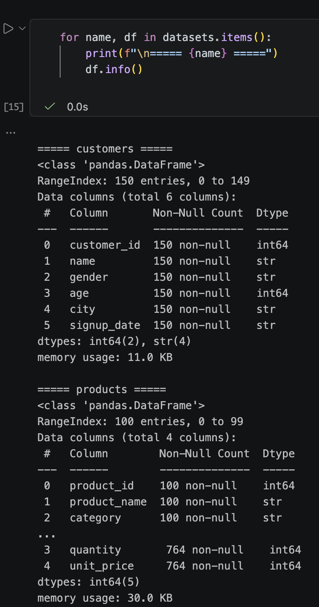
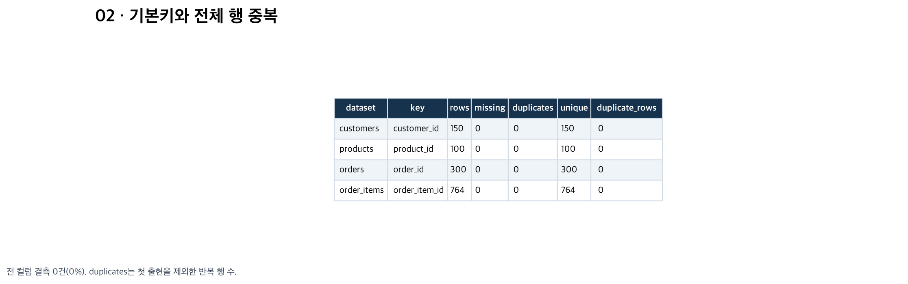
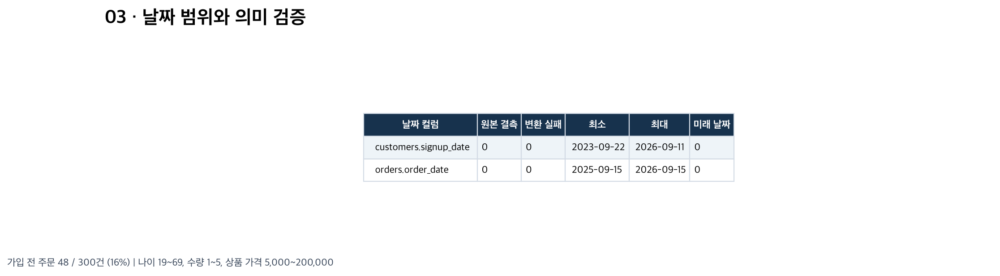
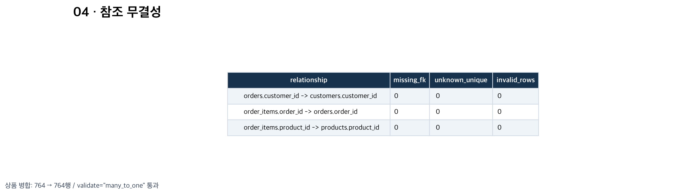
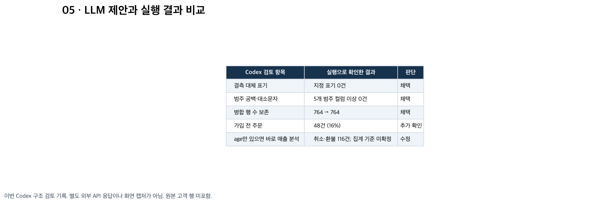

# Chapter 03 제출 답안. 데이터의 첫인상 읽기

> 주 제출물: `chapter03/chapter03.ipynb`. 이 문서의 답안은 Notebook의 Markdown 셀에도 포함했다. 증빙 이미지는 Notebook의 실제 실행 결과를 표로 렌더링한 자료다.

## 0. 제출 정보

- 이름: 송누리
- GitHub ID: HauserNR
- 작성일: 2026-09-23
- 최종 제출 URL(업로드 후 사용할 경로): https://github.com/HauserNR/llm-data-analysis-study/blob/main/chapter03/chapter03.ipynb
- 작성 기준: 첨부 과제 안내, `chapter03.md` 양식, 제공된 `notebooks/ch03_data_overview.ipynb`, 기존 CSV 4개.
- 실행 환경: Python 3.12.0, pandas 3.0.5, 프로젝트 `.venv`의 Jupyter 커널.
- 실행 방법: 저장소 루트 또는 `chapter03`에서 해당 커널을 선택하고 Restart Kernel → Run All.
- AI 활용: Codex가 코드 보완, 구조 요약 검토, 실행 및 답안 초안 작성을 도왔다. 아래 LLM 검토는 이번 Codex 작업의 검토 기록이며 별도 외부 API 호출 기록을 뜻하지 않는다.
- 확인 범위: [eTL 과제 안내](https://myetl.snu.ac.kr/courses/310975/assignments/378788)를 로그인 후 직접 확인했다. 실행 완료 Notebook, Notebook 내 Markdown 답안, 증빙 4~5장 및 최종 Notebook 파일 URL 제출 조건을 반영했다. 별도 Markdown은 검토용 사본이며 LMS의 기본 제출물은 Notebook이다. GitHub 업로드 및 eTL 제출은 아직 수행하지 않았다.

## 1. 데이터 로딩과 구조 확인

### 실행/결과

- **4개 CSV 로딩 여부:** `customers.csv`, `products.csv`, `orders.csv`, `order_items.csv`가 모두 존재했고, `pd.read_csv()`로 DataFrame에 로딩했다. 파일 존재 확인 결과도 네 개 모두 `True`였다.
- **각 데이터 shape:** `customers` (150, 6), `products` (100, 4), `orders` (300, 5), `order_items` (764, 5).
- **주요 컬럼:**
  - `customers`: `customer_id`, `name`, `gender`, `age`, `city`, `signup_date` (고객 한 명당 한 행).
  - `products`: `product_id`, `product_name`, `category`, `price` (상품 하나당 한 행).
  - `orders`: `order_id`, `customer_id`, `order_date`, `payment_method`, `order_status` (주문 한 건당 한 행).
  - `order_items`: `order_item_id`, `order_id`, `product_id`, `quantity`, `unit_price` (주문 상품 항목 한 개당 한 행).
- **dtypes에서 주목한 컬럼:** `customers.signup_date`와 `orders.order_date`는 날짜처럼 보이지만 로딩 직후 `str`이다. `age`, `price`, `quantity`, `unit_price`는 `int64`이며 각 ID도 `int64`다. ID는 숫자로 저장돼도 식별자이므로 평균의 의미가 없다. 현재 환경(pandas 3.0.5)에서는 문자열 컬럼이 `str`로 표시된다.

### Evidence

기존 Notebook의 `for name, df in datasets.items(): df.info()` 실행 결과 한 화면만 캡처한다. 이 출력에는 네 데이터셋의 행 수, 컬럼명, 결측이 아닌 값의 수, dtype이 함께 표시되어 1번 항목의 핵심 Evidence로 적합하다.

### 결과 관찰

네 파일 모두 열렸고 행 수는 `order_items` 764행이 가장 많다. `orders`는 300행이므로 주문상세 행 수가 주문 행 수보다 많다. 고객·주문 날짜 컬럼은 로딩 직후 문자열이고, 숫자처럼 저장된 ID 컬럼이 각 파일에 존재한다. `head()`/`tail()` 표본의 한글과 날짜 문자열은 읽을 수 있었으며 고객 이름은 출력에서 마스킹했다.

### 나의 해석과 판단

분석 전에 `orders`와 `order_items`의 **행 단위 차이**에 주의해야 한다. 주문상세 764행을 주문 764건으로 해석하면 주문 수를 과대 계산한다. `signup_date`와 `order_date`는 날짜 계산 전에 변환 가능 여부를 확인해야 한다. `order_status`는 이후 금액을 집계할 때 포함할 주문 범위를 정하는 데 중요하다.

### 업무·분석적 의미

한 행이 고객·상품·주문·주문 상품 항목 중 무엇을 나타내는지 확인하지 않으면 병합 후 건수나 금액이 부풀 수 있다. 문자열 날짜로 기간 분석을 시도하면 계산이 잘못되거나 실패할 수 있다. 식별자인 ID를 일반 숫자처럼 평균 내면 업무 의미가 없는 결과가 나온다.

### 한계와 추가 확인 사항

이 단계의 `shape`, `head()`, `tail()`, `columns`, `dtypes`, `info()`만으로는 **결측치, 전체 행·ID 중복, 숫자 범위, 날짜 변환 실패, 참조 무결성**을 알 수 없다. 표본 밖의 값이 정상인지도 단정할 수 없어 다음 절에서 별도로 점검한다.

## 2. 결측·중복·키 품질

### 실행/결과

| 데이터셋 | 주요 ID | ID 결측 | ID 중복(첫 행 제외) | 고유 ID 수 | 전체 행 중복 |
|---|---|---:|---:|---:|---:|
| customers | customer_id | 0 | 0 | 150 | 0 |
| products | product_id | 0 | 0 | 100 | 0 |
| orders | order_id | 0 | 0 | 300 | 0 |
| order_items | order_item_id | 0 | 0 | 764 | 0 |

전 컬럼의 `isna()` 결측 개수는 0건, 결측 비율은 0%다. 문자열의 빈 값·`-`·`unknown`·`n/a`·`null`·`none` 대체 표기도 공백 제거와 소문자화 후 점검했으며 0건이다.

### 결과 관찰

기본키 네 개는 모두 결측 없이 고유하다. 반면 `orders.customer_id`는 174건, `order_items.order_id`는 464건, `order_items.product_id`는 664건의 반복이 있다. 여기서 건수는 `duplicated()`가 첫 출현을 제외하고 센 행 수이며, 반복 ID의 종류 수가 아니다.

### 나의 해석과 판단

외래 키 반복은 고객의 여러 주문이나 주문의 여러 항목을 나타낼 수 있으므로 삭제 근거가 아니다. 실제 기본 결측·중복 문제는 없으므로 임의의 정제는 하지 않는다. 이후 문제가 발생하면 조인에 영향을 주는 기본키 결측·중복과 참조 불일치를 우선 확인하고, 일반 속성 결측은 업무적 의미를 확인한다.

### 업무·분석적 의미

주문상세에서 order_id 기준으로 중복을 삭제하면 정상 항목과 주문 금액이 사라진다. 반대로 부모 키 중복을 놓치면 병합 결과가 늘어나 금액이 부풀 수 있다.

### 한계와 추가 확인 사항

현재 점검은 기술적 결측과 지정한 대체 표기에 한정된다. 값이 채워져 있어도 잘못 입력된 나이·날짜일 수 있으며, 다른 코드로 표현된 미상값이 없는지는 데이터 사전과 비교해야 한다.

## 3. 숫자형·범주형·날짜 점검

### 실행/결과

| 컬럼 | 최솟값 | 최댓값 | 평균 | 중앙값 |
|---|---:|---:|---:|---:|
| customers.age | 19 | 69 | 42.09 | 40 |
| products.price | 5,000 | 200,000 | 110,040 | 112,000 |
| order_items.quantity | 1 | 5 | 3.05 | 3 |
| order_items.unit_price | 5,000 | 200,000 | 108,561.52 | 111,000 |

가격·수량·단가의 0 이하 값은 모두 0건이다. 나이 범위는 19~69세로 관측되지만 업무상 허용 연령은 별도 확인 대상이다.

- 성별: F 84명, M 66명.
- 도시: 성남 21, 광주 17, 부산 16, 대구 15, 서울 15, 울산 14, 인천 14, 대전 14, 수원 13, 고양 11명.
- 카테고리: 스포츠 19, 전자기기 17, 생활용품 16, 뷰티 16, 도서 14, 패션 11, 식품 7개. 이 빈도는 상품 수이지 판매 수량이 아니다.
- 결제수단: kakao_pay 79, naver_pay 77, bank_transfer 74, card 70건.
- 주문상태: completed 184건(61.33%), cancelled 64건(21.33%), refunded 52건(17.33%).
- 위 범주 컬럼의 앞뒤 공백과 공백 제거·대소문자 통일 시 합쳐지는 표기 변형은 0건이다. 의미상 동의어 전체를 검사한 것은 아니다.

| 날짜 컬럼 | 기존 결측 | 새 변환 실패 | 최솟값 | 최댓값 | 2026-09-23 이후 |
|---|---:|---:|---|---|---:|
| customers.signup_date | 0 | 0 | 2023-09-22 | 2026-09-11 | 0 |
| orders.order_date | 0 | 0 | 2025-09-15 | 2026-09-15 | 0 |

원본 문자열을 유지한 채 별도 Series로 변환했다. 새로운 변환 실패는 `원본.notna() & 변환값.isna()`로 계산해 기존 결측과 구분했다.

### 결과 관찰

날짜 형식 변환은 전부 성공했지만, 고객 키로 연결해 비교한 결과 **가입일보다 주문일이 빠른 주문이 48건, 전체 300건의 16%**다. 따라서 변환 성공과 업무적 타당성은 다르다. 주문 기간은 약 1년이지만 시작·종료 월인 9월은 각각 일부 날짜만 포함한다.

### 나의 해석과 판단

48건은 회원 가입 후에만 주문할 수 있는 시스템이라면 이상 후보지만, 비회원 주문·계정 이관 등 정책에 따라 설명될 가능성도 있다. 가상 데이터 생성 코드는 가입일과 주문일을 별도로 생성하므로 날짜 순서를 보장하지 않는다는 점도 확인했다. 이를 근거로 운영 시스템의 오류라고 단정하거나 날짜를 임의 수정하지 않는다.

### 업무·분석적 의미

가입 전 주문이 있으면 가입 후 첫 구매 소요일이나 코호트 분석이 왜곡된다. 월별 비교에서는 관측 기간이 완전한 월인지 확인해야 한다. 취소·환불 116건을 모두 매출로 포함하면 확정 매출과 다른 수치가 된다.

### 한계와 추가 확인 사항

허용 날짜 범위, 비회원 구매 정책, 통화 단위, 할인·부분 환불·세금 정의가 필요하다. `completed`만 선택하더라도 실제 정산 금액을 완전히 재현한다고 단정할 수 없다.

## 4. CSV 간 키 관계 검증

### 실행/결과

| 자식 → 부모 | 없는 ID 목록 | 없는 ID 종류 수 | 영향을 받는 행 | 외래 키 결측 |
|---|---|---:|---:|---:|
| orders.customer_id → customers.customer_id | [] | 0 | 0 | 0 |
| order_items.order_id → orders.order_id | [] | 0 | 0 | 0 |
| order_items.product_id → products.product_id | [] | 0 | 0 | 0 |

### 결과 관찰

세 관계 모두 참조 무결성 점검을 통과했다. `order_items`와 `products`를 `validate="many_to_one"`으로 병합했으며 행 수는 764 → 764로 유지됐다. 각 주문에는 1~4개 상세가 있다. 관측 기간에 주문이 없는 고객은 24명이다.

### 나의 해석과 판단

부모 ID의 고유성과 자식 ID의 참조 존재를 함께 확인했으므로 기본적인 다대일 연결은 가능하다. 주문 없는 고객은 비활성·신규 고객일 수 있어 오류로 삭제하지 않는다. 없는 키가 발견되더라도 파일 추출 시점 차이, 부모 파일 누락, 이관 등을 확인하기 전에 삭제하면 복구 가능한 거래가 사라질 수 있다.

### 업무·분석적 의미

참조 검증과 병합 행 수 확인은 조인으로 인한 누락·중복 계산을 예방한다. 제공 노트북의 병합 실습에서 계산한 카테고리별 금액은 모든 상태의 `quantity × unit_price` 합계다.

| 카테고리 | 전체 상태 포함 주문상세 금액(원본 단위) |
|---|---:|
| 스포츠 | 50,174,000 |
| 뷰티 | 47,551,000 |
| 전자기기 | 41,003,000 |
| 생활용품 | 34,839,000 |
| 식품 | 33,597,000 |
| 도서 | 24,645,000 |
| 패션 | 23,801,000 |

### 한계와 추가 확인 사항

키가 존재한다고 거래 의미까지 맞는 것은 아니다. 가입 전 주문 48건이 그 예다. 위 합계는 취소·환불·할인·세금을 반영한 순매출이나 카테고리 성과 결론이 아니다.

## 5. LLM 구조 설명 검증

### LLM에 제공한 Safe Context

이번 Codex 검토에는 데이터셋 크기, 실제 컬럼과 dtype, 결측 개수·비율, 주요 ID 결측·중복, 전체 중복, 범주 빈도, 날짜 범위, 참조 무결성의 집계 결과를 사용했다. 재사용 가능한 전체 구조 요약은 `safe_context.json` 및 Notebook 실행 출력에 저장했다. 고객 이름·원본 고객 행·API 키는 포함하지 않았다.

다음 질문으로 구조 검토 범위를 명시했다.

> 온라인 쇼핑몰 CSV 4개의 안전한 구조 요약을 검토해 주세요. 각 데이터셋의 한 행 의미, 기본키와 외래 키를 구분하고, 즉시 삭제하면 안 되는 사례와 추가 점검 우선순위를 설명해 주세요. 실제 컬럼에 없는 정보는 가정하지 말고 각 제안에 대해 pandas로 무엇을 확인할지 설명해 주세요. 원본 행 대신 safe_schema_summary를 사용합니다.

### LLM이 제안한 추가 점검과 실제 검증

| Codex 구조 검토 제안·설명 | 실제 확인 결과 | 판단 |
|---|---|---|
| 기본키 고유성과 외래 키 반복을 구분 | 네 PK 결측·중복 0; 주문상세 order_id 반복 464 | 채택. 외래 키 반복 삭제 안 함 |
| isna 외에 결측 대체 표기 확인 | 지정한 대체 표기 0건 | 채택. 다른 코드 여부는 보류 |
| 범주 공백·대소문자 차이 확인 | 다섯 범주 컬럼에서 공백·정규화 충돌 0건 | 채택. 의미상 동의어는 별도 확인 |
| 병합 관계 및 행 수 보존 확인 | many_to_one 검증 통과, 764 → 764 | 채택 |
| 변환 성공과 날짜 선후관계 구분 | 가입 전 주문 48건(16%) | 채택. 원인과 처리 기준은 보류 |
| age가 있으니 연령별 매출을 바로 계산할 수 있다는 제공 노트북의 가정 예시 | age 존재·결측 0, 키 연결 가능; 취소·환불 116건 및 날짜 문제 존재 | 수정. 컬럼 존재만으로 분석 준비 완료 판단 불가 |

### 결과 관찰

기본키·참조 관계 및 지정한 결측 대체 표기는 점검을 통과했다. 추가 날짜 비교에서는 가입 전 주문 48건을 확인했고, 주문상태에는 취소·환불 116건이 포함되어 있었다. 이는 실행 결과로 확인한 사실이며 원인에 대한 확정은 아니다.

### 업무·분석적 의미

LLM 제안을 실행 가능한 점검 항목으로 바꾸고 결과를 대조하면, 잘못된 중복 삭제나 매출 과대 집계를 예방할 수 있다. 채택·수정·보류를 남기면 다음 분석 단계에서 확인된 사실과 미확정 업무 규칙을 구분할 수 있다.

### 나의 해석과 판단

가장 유용한 제안은 날짜 형식과 업무적 선후관계를 나눠 확인한 것이다. 기본 점검을 통과해도 가입 전 주문 48건이 남았다. 가장 조심할 것은 ID의 반복을 오류로 단정하거나 age 컬럼이 있다는 이유만으로 매출 분석을 바로 권하는 설명이다. 실제 컬럼과 키 관계에 맞는 제안만 채택했다.

### 한계와 추가 확인 사항

LLM 검토는 업무 규칙의 확인을 대신하지 못한다. 별도의 API 응답을 받은 것처럼 기록하지 않았으며, 대화의 구조 검토 내용을 코드 실행 결과와 비교해 정리했다. 원본 고객 행의 추가 제공 없이 정책·데이터 사전으로 미확정 항목을 확인해야 한다.

## 6. Chapter 03 최종 판단

### 데이터의 첫인상 3가지

1. 고객 150명, 상품 100개, 주문 300건, 상세 764행의 관계형 실습 데이터다. 기본 결측·전체 중복·PK 중복·없는 참조 키는 발견되지 않았다.
2. 데이터 타입과 의미는 다르다. ID는 측정값이 아니고 날짜는 문자열이며, 변환 성공 후에도 가입 전 주문 48건이 남는다.
3. 완료·취소·환불 상태가 섞여 있다. 연결 가능한 데이터라는 사실과 매출 분석 기준이 확정됐다는 것은 별개다.

### 다음 Chapter 전에 반드시 확인/처리해야 할 항목

1. 가입 전 주문 48건을 품질 이슈로 기록하고, 비회원 주문 여부 및 합성 데이터 생성 규칙을 확인한다. 날짜 의존 분석은 기준 확정 전 유보한다.
2. 주문 수·주문상세 수·전체 주문 금액·확정 매출의 정의를 구분하고 취소·환불, 금액 단위, 분석 기간 기준을 정한다.
3. 날짜 변환과 키 검증을 재현 가능한 코드로 유지한다. 삭제·대체·날짜 수정은 이번 장에서 하지 않고 Chapter 05에서 업무 규칙에 따라 결정한다.

### 현재 데이터만으로 단정할 수 없는 것

실제 사업의 매출·고객 특성·카테고리 성과, 가입 전 주문의 업무적 오류 여부, 정확한 통화와 정산 금액, 데이터 누락 여부 및 실거래 대표성은 확정할 수 없다.

### 데이터 품질 발견 기록

| 데이터셋·컬럼 | 문제/주의 종류 | 건수 | 해석 | 처리 여부 |
|---|---|---:|---|---|
| orders.order_date ↔ customers.signup_date | 가입 전 주문 | 48주문 | 시간 의미 검증 필요 | 기록, Chapter 05에서 결정 |
| orders.order_status | cancelled / refunded | 64 / 52주문 | 집계 기준 필요; 자체가 오류는 아님 | 유지 |
| order_items.order_id | FK 반복(첫 출현 제외) | 464행 | 한 주문의 여러 상세 가능 | 유지 |
| customers.customer_id | 주문 없는 고객 | 24명 | 관측 기간 내 구매 없음 | 유지 |

## 부록. 자습 과제

### 과제 1. 네 파일 데이터 사전

| 데이터셋 | 한 행 | PK | FK | 측정 숫자형 | 범주형 | 날짜 후보(원본 str) |
|---|---|---|---|---|---|---|
| customers | 고객 | customer_id | 없음 | age | gender, city | signup_date |
| products | 상품 | product_id | 없음 | price | category | 없음 |
| orders | 주문 | order_id | customer_id | 없음 | payment_method, order_status | order_date |
| order_items | 주문 상품 항목 | order_item_id | order_id, product_id | quantity, unit_price | 없음 | 없음 |

`name`과 `product_name`은 이름을 나타내는 문자열 속성이다. ID는 int64로 저장되지만 측정 숫자형 항목에서 제외했다.

### 과제 2. 발견과 처리 구분하기 — 가정 사례

아래 수치는 실제 데이터에서 발견한 결과가 아니라 과제에서 제시한 가정이다.

| 가정 문제 | 위험 수준 | 추가 확인 | 이번 장에서 할 일 | 전처리 장에서 결정 |
|---|---|---|---|---|
| 고객 나이 5건 결측 | 중간 | 선택 입력인지, 특정 집단에 편중됐는지 | 건수·비율 및 분포 기록 | 분석별 제외/대체 여부 |
| 고객 ID 1건 중복 | 높음 | 동일 고객 재적재인지, 속성 충돌인지 | 중복 행과 키 단위 기록 | 병합/대표행/원천 수정 |
| Complete와 completed 혼재 | 중간 | 실제 같은 상태인지 | 원본 값과 빈도 기록 | 공식 매핑 후 표준화 |
| 상세의 주문 ID 2건이 부모에 없음 | 높음 | 추출 시점·기간·부모 누락 여부 | ID 종류 수와 영향 행 수 분리 | 부모 복구/격리/제외 기준 |

### 과제 3. 데이터 타입 오류 사례

`["1000", "2,000", "unknown", None, " 3500 "]`의 원본 dtype은 `str`이다. 쉼표와 공백을 제거하고 `pd.to_numeric(errors="coerce")`를 실행하면 `[1000.0, 2000.0, NaN, NaN, 3500.0]`이 된다. 기존 결측 1건, 변환 후 결측 2건, 새 변환 실패는 `unknown` 1건이다. `None`까지 변환 실패로 세지 않는다. 원본·정리값·변환값 비교표는 Notebook에 포함했다.

### 과제 4. 안전한 LLM 구조 질문

5절의 질문과 `safe_context.json`을 사용한다. 집계 및 구조 정보만 전달하고 실제 데이터에 없는 컬럼과 관계를 가정하지 않도록 요청한다.

## 최종 제출 체크

- [x] Notebook을 처음부터 끝까지 실행했습니다.
- [x] 오류 셀이 남아 있지 않습니다.
- [x] 핵심 Evidence를 첨부했습니다.
- [x] 관찰과 해석을 구분했습니다.
- [x] 원본 고객 이름을 마스킹하고 Secret을 포함하지 않았습니다(제출자 이름·GitHub ID는 제출 정보에 기재).
- [ ] `chapter03/chapter03.ipynb`가 GitHub에서 정상 표시됩니다. — 업로드 후 확인 필요.
- [ ] 최종 Notebook 파일 URL을 제출합니다. — eTL 제출 전.
